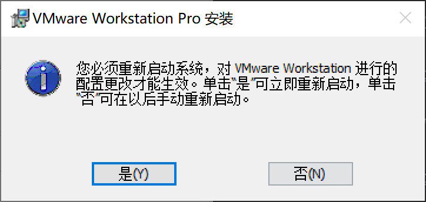

# virtual-lammps

virtual-lammps是一个旨在降低lammps安装门槛，便于更多windows使用者系统学习lammps的项目

## 使用教程

### 虚拟机下载安装

[VMware下载地址](https://pan.baidu.com/s/1h9w0Xza-rZtUCVnn_BzQWA?pwd=1wcn "限速百度 不得好死")

1.右击安装包，以管理员身份运行。用户账户控制选择“是”

2.在弹出的界面中，依次选择“下一步”  “我接受条款”  “下一步”

3.自定义安装位置，安装位置最好`没有中文和空格`。安装“增强型键盘驱动程序”，选择“下一步”


4.取消“检查产品更新”  “加入客户体验计划”，依次选择“下一步”  “下一步”  “安装”


5.请注意！安装完成时，单击许可证，复制一个`16.2.5`版本VMware workstation的许可证密钥，单击“输入”。单击“完成”退出安装


6.重新启动系统，选择“是”



> 后续会考虑打包成一个iso文件以支持其他虚拟机软件，看需要的人多不多

### 虚拟机镜像配置

[镜像下载链接](https://pan.baidu.com/s/1iuoefJK-9R7SEEHcB1NHig?pwd=q5rc "限速百度 不得好死")

1.选择一种镜像下载，创建一个名为`debian`（也可以自己改，方便找就行）的文件夹，将下载好的镜像复制进去，直接解压到当前目录。

（这里使用的是7z自解压exe文件，见下图选中）


2.打开VMware，选择“打开虚拟机”


找到刚刚的`debian`文件夹，选择文件`Debian 11.6 64 位 的克隆.vmx`，打开


即可看到已经配置好的虚拟机


3.屏幕最下一行右击，打开Windows系统的任务管理器。


菜单栏下一行选择“性能”，记住自己机器的几个参数：
内存、内核、逻辑处理器


回到虚拟机，单击“编辑虚拟机设置”。


选择左侧“处理器”，处理器数量 可以设置的 最大值为`内核`数量减一


> 若`逻辑处理器`数量为`内核`数量2倍，`每个处理器的内核数量`可以设置为2或1
> 若`逻辑处理器`数量为`内核`数量1倍，`每个处理器的内核数量`只能设置为1

单击“确定”，完成虚拟机设置

4.单击“开启此虚拟机”，启动虚拟机


开机需要等待一阵子，双击中间的用户`moon`，输入密码debian_11，回车，则可以自由探索debian系统


5.在虚拟机中，先按`win`键，输入`setting`，找到系统设置。左侧选择网络，右侧选择有线最后的`设置`按钮，记下虚拟机的`IPv4地址`


### VS Code下载安装

[VS Code安装包](https://pan.baidu.com/s/1WAMHIWa9NR4lz35gzlinFQ?pwd=vmlm "限速百度 不得好死")

当然，也可以自己去官网找一下

1.右击exe安装包，打开


2.依次选择“我同意此协议”  “下一步”，选择安装位置


3.选择两次“下一步”，附加任务全部勾选，选择“下一步”  “安装”


4.安装完成，运行VS Code

### VS Code设置

1.首先安装中文语言包，VS Code会自动重启


2.左上角单击“文件”，选择打开一个特定的文件夹，此处为`code`。可以在左侧资源管理器看到code文件夹力的文件


3.VS Code最左侧选择最下面一个按钮，在搜索栏搜索并安装`Lammps Syntax Highlighting`插件，图示即安装好了


4.搜索并安装`sftp`插件。最左侧选择第一个按钮，切换到资源管理器。

使用快捷键`ctrl+shift+P`，在顶端搜索`SFTP`，单击对`SFTP:Config`进行设置。得到如下文件：


将上传的sftp.json文件用记事本打开，复制进VS Code

需要注意的是，此处`host`的值应该用上面的`IPv4地址`来替代

`ctrl+S`保存，退出

（这一步也可以直接在此电脑中用记事本修改上传到json文件，再复制以替换原来的文件，但需要先关掉VS Code再替换）


5.搜索并安装`Remote - SSH`插件。最左侧选择倒数第二个按钮，切换到远程资源管理器。

选择左侧远程资源管理器，单击SSH后的“设置图标”


选择第一个文件，即打开"C:\Users\你的用户名\.ssh\config"


同样地，用上传的config文件替换你本地的config文件，文本复制或是直接文件替换请自便

同样需要注意的是，此处`host`的值应该用上面的`IPv4地址`来替代

7.重启VS Code，此时设置已全部完成

### 日常使用指南

1.打开虚拟机，进入虚拟机里的debian系统

2.打开VS Code，最左侧选择倒数第二个按钮，切换到远程资源管理器。

3.选择“远程-SSH-cy-code”后的第二个按钮，在新窗口中打开远程链接，第一次使用会有很长的设置时间


4.这里直接选择用密码而非密钥文件，输入“yes“并回车


输入密码debian_11，并回车。在linux系统有关的设置中，密码并不会随着输入而显示，直接输入并回车即可。（不知为何，第一次连接时会提示管道不存在。关闭VS Code从第二步重新开始即可）


5.在最左侧选择扩展，选择`在ssh:cy`上安装Lammps Syntax Highlighting扩展


6.我们可以在左侧lammps文件夹下新建一个in.test 输入boundary p p p，观察插件的运行情况。（更多功能请看插件详情页，即安装页面）


7.运行一个lammps例子。首先在虚拟机中找一个lammps例子移动到`\home\moon\code\lammps`中，和win类似的操作即可。（先按`win`在左侧找到”文件“，例子在/用户文件夹/opt/lammps-23Jun2022/examples）


此处我们找到in.fire


8.调整Terminal终端。在下方终端处直接点击`+`，或者点击`bash`


输入`cd lammps`进入lammps文件夹


9.并行运行lammps

以当前的4核8线程虚拟机为例，这里的命令为`mpirun -np 8 lmp -in in.fire`

-np后的数字的最大值为虚拟机`每个处理器的内核数量`乘以`处理器数量`

-in后输入你想要运行的lammps文件

中间用空格隔开

10.Windows和虚拟机之间的文件传输

从虚拟机下载文件，右击，选择下载


windows上传到虚拟机，右击，upload file（默认上传到code文件夹）


```bash
moon@moon:~/code$ cd lammps
moon@moon:~/code/lammps$ mpirun -np 8 lmp -in in.fire
LAMMPS (23 Jun 2022 - Update 3)
OMP_NUM_THREADS environment is not set. Defaulting to 1 thread. (src/comm.cpp:98)
  using 1 OpenMP thread(s) per MPI task
Lattice spacing in x,y,z = 1.5391903 1.5391903 1.5391903
Created orthogonal box = (0 0 -0.15391903) to (30.783806 30.783806 0.15391903)
  4 by 2 by 1 MPI processor grid
Created 800 atoms
  using lattice units in orthogonal box = (0 0 -0.15391903) to (30.783806 30.783806 0.15391903)
  create_atoms CPU = 0.006 seconds
Generated 0 of 0 mixed pair_coeff terms from geometric mixing rule
Neighbor list info ...
  update every 1 steps, delay 0 steps, check yes
  max neighbors/atom: 2000, page size: 100000
  master list distance cutoff = 2.8
  ghost atom cutoff = 2.8
  binsize = 1.4, bins = 22 22 1
  1 neighbor lists, perpetual/occasional/extra = 1 0 0
  (1) pair lj/cut, perpetual
      attributes: half, newton on
      pair build: half/bin/atomonly/newton
      stencil: half/bin/2d
      bin: standard
Setting up Verlet run ...
  Unit style    : lj
  Current step  : 0
  Time step     : 0.005
Per MPI rank memory allocation (min/avg/max) = 3.049 | 3.049 | 3.049 Mbytes
   Step          Temp          E_pair         E_mol          TotEng         Press     
         0   5             -2.461717       0              2.532033       5.0190509    
       100   3.2788864     -0.74311698     0              2.5316708      15.912832    
       200   3.3041082     -0.77000277     0              2.5299752      15.602653    
       300   3.3840228     -0.84859211     0              2.5312006      15.188203    
       400   3.3916063     -0.85694601     0              2.5304208      15.383853    
       500   3.3136052     -0.77935263     0              2.5301106      15.833296    
       600   3.3888915     -0.85213737     0              2.532518       15.162759    
       700   3.2123649     -0.67641967     0              2.5319297      16.310583    
       800   3.3016375     -0.76570232     0              2.5318081      15.639273    
       900   3.4622271     -0.92615927     0              2.5317401      14.773596    
      1000   3.3050343     -0.76996308     0              2.5309399      15.712159    
Loop time of 0.0513283 on 8 procs for 1000 steps with 800 atoms

Performance: 8416404.065 tau/day, 19482.417 timesteps/s
91.9% CPU use with 8 MPI tasks x 1 OpenMP threads

MPI task timing breakdown:
Section |  min time  |  avg time  |  max time  |%varavg| %total
---------------------------------------------------------------
Pair    | 0.0072989  | 0.0084472  | 0.011503   |   1.5 | 16.46
Neigh   | 0.0042345  | 0.0046256  | 0.0057238  |   0.7 |  9.01
Comm    | 0.023082   | 0.028429   | 0.03193    |   1.7 | 55.39
Output  | 0.00034182 | 0.0005867  | 0.0013442  |   0.0 |  1.14
Modify  | 0.00078548 | 0.00099484 | 0.001502   |   0.0 |  1.94
Other   |            | 0.008245   |            |       | 16.06

Nlocal:            100 ave         104 max          97 min
Histogram: 4 0 0 0 0 1 0 0 1 2
Nghost:        133.875 ave         139 max         126 min
Histogram: 1 1 0 1 0 0 0 2 1 2
Neighs:        967.375 ave        1029 max         903 min
Histogram: 2 0 2 0 0 0 1 0 0 3

Total # of neighbors = 7739
Ave neighs/atom = 9.67375
Neighbor list builds = 203
Dangerous builds = 0
Generated 0 of 0 mixed pair_coeff terms from geometric mixing rule
Setting up fire style minimization ...
  Unit style    : lj
  Current step  : 1000
Per MPI rank memory allocation (min/avg/max) = 3.049 | 3.049 | 3.049 Mbytes
   Step          Temp          E_pair         E_mol          TotEng         Press     
      1000   0             -0.76996308     0             -0.76996308     12.925537    
      1050   0.029286897   -2.7825551      0             -2.7533048     -0.89196809   
      1100   0.0060944057  -2.8540653      0             -2.8479785     -1.1785449    
      1150   0.0030341097  -2.8740669      0             -2.8710365     -1.1951493    
      1200   8.4936253e-05 -2.8788444      0             -2.8787595     -1.1830603    
      1250   0.00041671563 -2.8808326      0             -2.8804164     -1.2013445    
      1300   0.0015815589  -2.8888989      0             -2.8873193     -1.2671573    
      1350   0.00016936629 -2.8919957      0             -2.8918266     -1.2620935    
      1400   0.00028237556 -2.8929565      0             -2.8926744     -1.2668282    
      1450   0.00043143218 -2.897762       0             -2.8973311     -1.3090928    
      1500   8.1421687e-05 -2.8989821      0             -2.8989008     -1.2878058    
      1550   0.00016672876 -2.8996967      0             -2.8995302     -1.257972     
      1600   0.00041957979 -2.9015705      0             -2.9011514     -1.2396189    
      1650   9.742115e-05  -2.9026248      0             -2.9025275     -1.2078419    
      1700   0.00011219272 -2.9029838      0             -2.9028718     -1.1905969    
      1750   7.028405e-05  -2.9032673      0             -2.9031971     -1.1666976    
      1800   0.0002589894  -2.903596       0             -2.9033374     -1.1193876    
      1850   2.0059801e-05 -2.9040209      0             -2.9040009     -1.1000496    
      1900   0.00020853909 -2.9044373      0             -2.9042291     -1.1128174    
      1950   8.884604e-05  -2.909154       0             -2.9090653     -1.1327705    
      2000   0.00031345266 -2.9121614      0             -2.9118484     -1.1228829    
      2050   0.00036608196 -2.9133703      0             -2.9130046     -1.1040421    
      2100   0.00025052094 -2.9152579      0             -2.9150076     -1.0709312    
      2150   1.3115588e-06 -2.9153984      0             -2.9153971     -1.0653447    
      2200   3.11679e-07   -2.9154007      0             -2.9154004     -1.0654121    
      2250   1.0093704e-07 -2.9154021      0             -2.915402      -1.0650731    
      2300   6.5833069e-08 -2.9154023      0             -2.9154023     -1.0646177    
      2350   2.3414928e-08 -2.9154025      0             -2.9154025     -1.0641388    
      2400   1.6611928e-10 -2.9154025      0             -2.9154025     -1.0640588    
      2450   1.4241555e-11 -2.9154025      0             -2.9154025     -1.0640517    
      2500   1.8285763e-12 -2.9154025      0             -2.9154025     -1.0640507    
      2550   2.6252372e-17 -2.9154025      0             -2.9154025     -1.0640503    
      2600   4.235802e-16  -2.9154025      0             -2.9154025     -1.0640503    
      2630   2.6856989e-16 -2.9154025      0             -2.9154025     -1.0640503    
Loop time of 0.13719 on 8 procs for 1630 steps with 800 atoms

90.3% CPU use with 8 MPI tasks x 1 OpenMP threads

Minimization stats:
  Stopping criterion = force tolerance
  Energy initial, next-to-last, final = 
    -0.769963084628743  -2.91540250464415  -2.91540250464415
  Force two-norm initial, final = 1953.1397 9.59667e-07
  Force max component initial, final = 359.63283 4.5052999e-07
  Final line search alpha, max atom move = 0 0
  Iterations, force evaluations = 1630 1644

MPI task timing breakdown:
Section |  min time  |  avg time  |  max time  |%varavg| %total
---------------------------------------------------------------
Pair    | 0.019806   | 0.024578   | 0.027153   |   1.6 | 17.92
Neigh   | 0.0012567  | 0.0014459  | 0.0018156  |   0.5 |  1.05
Comm    | 0.033783   | 0.039116   | 0.045574   |   1.6 | 28.51
Output  | 0.00073841 | 0.0011255  | 0.0037964  |   3.0 |  0.82
Modify  | 0.00027078 | 0.00036668 | 0.00045106 |   0.0 |  0.27
Other   |            | 0.07056    |            |       | 51.43

Nlocal:            100 ave         105 max          91 min
Histogram: 1 0 0 0 1 0 1 3 1 1
Nghost:        135.625 ave         140 max         125 min
Histogram: 1 0 0 0 0 0 2 1 1 3
Neighs:         870.25 ave         918 max         783 min
Histogram: 1 0 0 1 0 1 1 1 1 2

Total # of neighbors = 6962
Ave neighs/atom = 8.7025
Neighbor list builds = 73
Dangerous builds = 0
Total wall time: 0:00:00
moon@moon:~/code/lammps$ 
```

## 实现方式介绍

主要适用于Windows系统连接到本地linux虚拟机，以实现简化lammps的安装

### 本地windows客户端

使用Visual Studio Code中的ssh插件链接本地虚拟机，以实现在windows系统下便捷编译lammps文件，并且学习基本的linux操作

### 虚拟机软件

VMware-16.2.5

#### 虚拟机基础设置

用户名称：moon

虚拟机 *用户密码和超级用户密码*均为：debian_11

系统选择了Debian11(bullseye)+gnome，已添加sudoer用户，更换清华镜像源。笔者认为较为适合新手学习linux使用。 

#### 软件位置等

在/home/moon文件夹下，新建了两个文件夹。其中,

/opt用于存放软件安装路径，其子目录/installation_package为安装包

换言之，/installation中的文件可以删除（不过也不占太大空间）

/code文件夹用于存放调试代码（已经将环境变量设置好，直接运行即可）
